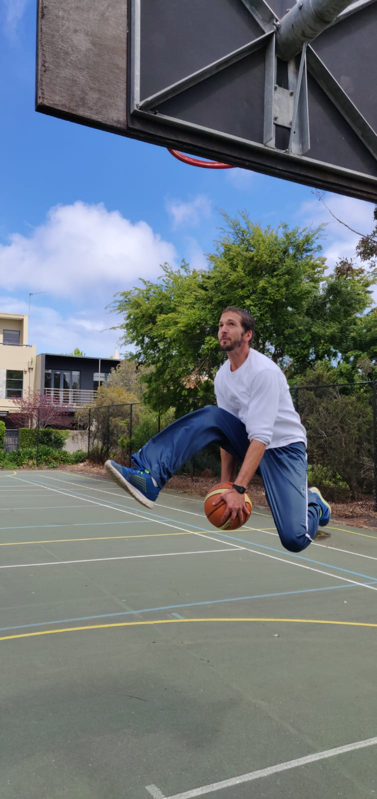

---
title: Extra
summary: My courses
type: landing

cascade:
  - _target:
      kind: page
    params:
      show_breadcrumb: true

sections:
  - block: markdown
    id: extra
    content:
      title: Extra
      filters:
        folders:
          - Extra
      text: |-
        I am a quite tall dude so I was destined to play basketball from a young age. I used to play for a team as a kid, but I didn't like it very much because I felt there is a lack of freedom and creativity there. So I quit the team and started to go to outdoors courts in my hometown almost every day, practicing moves from [NBA street](https://en.wikipedia.org/wiki/NBA_Street). I got pretty good at these and eventually I joined the local streetball team for a brief period, but then I realized that I should study more seriously for my physics exams and decided to quit my successful streetball career at the age of 18 😂.

        
        

        I still play basketball, during the weekends mostly. I like playing 3X3 on half-court rather 5X5 on full-court (these are completely different games of basketball!). If you challenge me, I can play 1X1, though it's becoming harder as I'm getting older. I'm not fully convinced yet, but I'm starting to realize that there is a chance I might not get to the NBA after all...
        
        Speaking of NBA, I'm a big fan. It's quite challenging to follow matches when you live outside the US (plus, there are way too many games during the regular season), but when it's playoff time I'm used to wake up at 3AM and fully watch interesting matches. The obvious downside is that you get tired to work the next day (don't tell my boss) but that is totally worth the price of nobody spoiling you the final score. I'm also into NBA history and I like to complain how modern basketball is not as entertaining as it once was during the 80/90/00's eras. This gives you a hint to where I stand in the goat discussion 🐐.    
    design:
      view: article-grid
      columns: 2
  #    
---